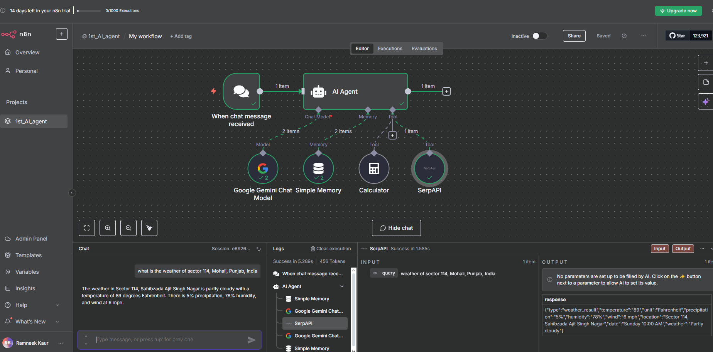

# 🤖 My First AI Agent using n8n

Welcome to my first AI automation project!  
This repository contains the workflow JSON file for an intelligent **AI Agent** built using [n8n](https://n8n.io/) – a powerful, low-code automation platform.

This agent can **respond to user queries**, **retrieve real-time information** (like weather), **perform calculations**, and **retain memory context** — all by integrating various AI and automation tools.

It marks my very first step toward building intelligent, autonomous agents that can assist in real-world tasks and reduce repetitive human effort.

---

## 🚀 Overview

In this project, I created a smart **AI chat agent** that:
- Listens to incoming chat messages
- Uses a large language model (LLM) to process natural language queries
- Fetches real-time information (e.g., weather or search)
- Performs arithmetic calculations
- Retains memory for context-based responses

This is fully built using **n8n's visual editor**, leveraging AI + automation in a seamless flow.

---

## Tech Stack Used
Tool / Platform	Purpose:
- 🔧 n8n	Visual workflow builder to automate and integrate services
- 🧠 Google Gemini Pro (v2)	Large Language Model for intelligent, human-like responses
- 💾 Simple Memory Node	Stores conversation context (like short-term memory)
- 🧮 Calculator Node	Performs basic calculations within the conversation
- 🌐 SerpAPI	Fetches real-time data like weather, facts, or search results

---

## 🧠 How the Tech Stack Works Together:
- n8n acts as the visual automation brain, orchestrating all actions and flows.
- Google Gemini is the core intelligence that understands queries and responds conversationally.
- Simple Memory lets the agent remember short-term facts or names between turns.
- SerpAPI adds live data capabilities (like weather updates or Google searches).
- Calculator solves arithmetic operations on the fly.

---

## 🔍 How It Works
- Trigger: The agent starts when a user sends a chat message via a trigger node.
- Routing & Reasoning: The AI Agent node receives the query and routes it through the appropriate tool.

  ---

## 🎯 Future Improvements/ Future Projects leveraging this agent
- Deploy as a Telegram or Discord chatbot
- Embed it in the chat UI
- Add support for voice-based interactions
- Integrate Notion/Slack/Calendar APIs
- Use LangChain for reasoning + memory
- Add vector memory (Pinecone / Chroma) for long-term memory

---
 

